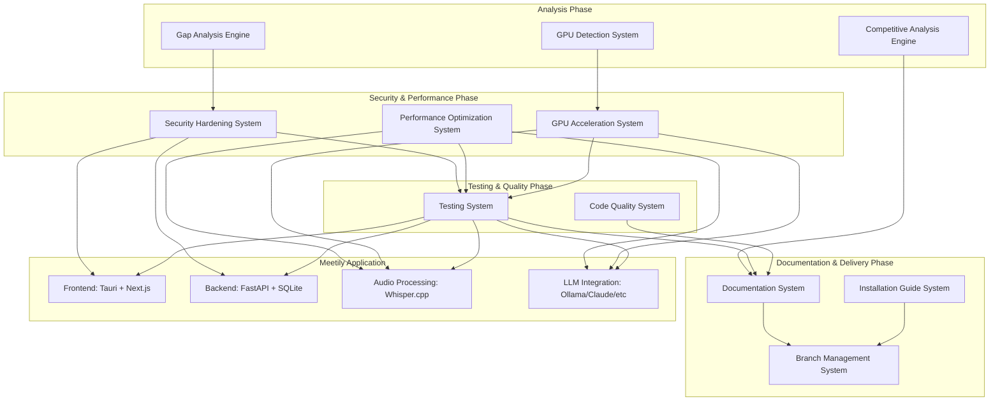

# Design Document: Meetily Codebase Gap Analysis and Improvement

## Overview

This design outlines a comprehensive improvement project for the Meetily meeting minutes application, transforming it from its current state (lacking tests, security issues, performance bottlenecks) into a production-ready, secure, and well-documented application. The project encompasses gap analysis, security hardening, comprehensive testing, performance optimization, documentation enhancement, code quality improvements, competitive analysis, GPU acceleration, and Linux installation guides.

The design follows a phased approach: Analysis → Security & Performance → Testing & Quality → Documentation & Delivery, ensuring systematic improvement while maintaining application functionality throughout the process.

## Architecture

### System Architecture Overview



### Component Interaction Flow

1. **Analysis Phase**: Gap Analysis and Competitive Analysis engines examine the current codebase and market landscape
2. **Security & Performance Phase**: Security hardening addresses vulnerabilities while performance optimization and GPU acceleration improve efficiency
3. **Testing & Quality Phase**: Comprehensive testing suite validates all improvements while code quality system ensures maintainability
4. **Documentation & Delivery Phase**: Enhanced documentation and installation guides are created, then delivered via organized GitHub branch

## Components and Interfaces

### Gap Analysis Engine

**Purpose**: Systematically analyze the Meetily codebase to identify missing functionality, security vulnerabilities, performance bottlenecks, and code quality issues.

**Core Components**:
- **Code Scanner**: Static analysis tool for identifying patterns, vulnerabilities, and quality issues
- **Security Analyzer**: Specialized scanner for CORS, authentication, and credential storage issues
- **Performance Profiler**: Tool for identifying bottlenecks in audio processing and model loading
- **Documentation Auditor**: System for identifying missing or inadequate documentation

**Key Interfaces**:
```typescript
interface GapAnalysisEngine {
  scanCodebase(path: string): Promise<GapAnalysisReport>
  analyzeSecurityVulnerabilities(): Promise<SecurityIssue[]>
  identifyPerformanceBottlenecks(): Promise<PerformanceIssue[]>
  auditDocumentation(): Promise<DocumentationGap[]>
}

interface GapAnalysisReport {
  securityIssues: SecurityIssue[]
  performanceIssues: PerformanceIssue[]
  codeQualityIssues: CodeQualityIssue[]
  documentationGaps: DocumentationGap[]
  prioritizedRecommendations: Recommendation[]
}
```

### Security Hardening System

**Purpose**: Address all identified security vulnerabilities including CORS configuration, API authentication, and credential storage.

**Core Components**:
- **CORS Configuration Manager**: Replaces wildcard CORS with specific allowed origins
- **Authentication System**: Implements proper API authentication mechanisms
- **Credential Encryption Service**: Secures sensitive credential storage
- **Input Validation Framework**: Validates and sanitizes all user inputs
- **Security Headers Manager**: Adds appropriate security headers to HTTP responses

**Key Interfaces**:
```typescript
interface SecurityHardeningSystem {
  hardenCORSConfiguration(allowedOrigins: string[]): Promise<void>
  implementAPIAuthentication(): Promise<AuthenticationConfig>
  encryptCredentialStorage(): Promise<void>
  addInputValidation(endpoints: APIEndpoint[]): Promise<void>
  configureSecurityHeaders(): Promise<SecurityHeadersConfig>
}

interface AuthenticationConfig {
  tokenType: 'JWT' | 'Bearer'
  expirationTime: number
  refreshTokenEnabled: boolean
  encryptionAlgorithm: string
}
```

### Performance Optimization System

**Purpose**: Address performance bottlenecks in audio processing and model loading to improve overall application efficiency.

**Core Components**:
- **Audio Processing Optimizer**: Optimizes Whisper.cpp integration and audio format handling
- **Model Loading Manager**: Implements lazy loading and caching for LLM models
- **Memory Management System**: Reduces peak memory consumption during processing
- **Concurrent Processing Engine**: Enables parallel processing of audio chunks
- **Database Query Optimizer**: Implements efficient queries with proper indexing

**Key Interfaces**:
```typescript
interface PerformanceOptimizationSystem {
  optimizeAudioProcessing(): Promise<AudioOptimizationResult>
  implementModelCaching(): Promise<ModelCacheConfig>
  optimizeMemoryUsage(): Promise<MemoryOptimizationResult>
  enableConcurrentProcessing(): Promise<ConcurrencyConfig>
  optimizeDatabaseQueries(): Promise<DatabaseOptimizationResult>
}

interface AudioOptimizationResult {
  processingTimeReduction: number
  memoryUsageReduction: number
  concurrentChunksSupported: number
}
```

### GPU Acceleration System

**Purpose**: Automatically detect and utilize local GPU hardware for LLM inference and audio processing acceleration.

**Core Components**:
- **GPU Detection Service**: Identifies available GPU hardware (Intel, AMD, Nvidia)
- **LLM GPU Accelerator**: Utilizes GPU for language model operations
- **Audio GPU Accelerator**: Leverages GPU for Whisper.cpp and transcription tasks
- **Fallback Manager**: Gracefully handles GPU incompatibility with CPU fallback
- **Performance Monitor**: Reports GPU utilization and performance metrics

**Key Interfaces**:
```typescript
interface GPUAccelerationSystem {
  detectGPUHardware(): Promise<GPUInfo[]>
  accelerateLLMInference(modelConfig: ModelConfig): Promise<GPUAccelerationResult>
  accelerateAudioProcessing(audioConfig: AudioConfig): Promise<GPUAccelerationResult>
  configureGPUSettings(settings: GPUSettings): Promise<void>
  monitorGPUPerformance(): Promise<GPUPerformanceMetrics>
}

interface GPUInfo {
  vendor: 'Intel' | 'AMD' | 'Nvidia' | 'Other'
  model: string
  memoryGB: number
  computeCapability: string
  driverVersion: string
  isCompatible: boolean
}
```

### Testing System

**Purpose**: Implement comprehensive test coverage including unit tests, integration tests, end-to-end tests, and property-based tests.

**Core Components**:
- **Unit Test Framework**: Achieves 80%+ code coverage across all components
- **Integration Test Suite**: Tests API endpoints and database interactions
- **End-to-End Test Runner**: Tests complete user workflows
- **Property-Based Test Engine**: Tests critical data transformations and parsing
- **Test Automation Pipeline**: Runs all tests in CI/CD with reporting

**Key Interfaces**:
```typescript
interface TestingSystem {
  generateUnitTests(components: Component[]): Promise<UnitTestSuite>
  createIntegrationTests(apiEndpoints: APIEndpoint[]): Promise<IntegrationTestSuite>
  buildE2ETests(userWorkflows: UserWorkflow[]): Promise<E2ETestSuite>
  implementPropertyTests(properties: Property[]): Promise<PropertyTestSuite>
  setupTestAutomation(): Promise<TestAutomationConfig>
}

interface TestCoverageReport {
  overallCoverage: number
  componentCoverage: Map<string, number>
  uncoveredLines: string[]
  testExecutionTime: number
}
```

### Code Quality System

**Purpose**: Eliminate code duplication, standardize error handling, and improve overall maintainability.

**Core Components**:
- **Duplication Eliminator**: Refactors duplicate code into reusable functions
- **Error Handling Standardizer**: Implements consistent error patterns
- **Code Formatter**: Applies consistent formatting and linting rules
- **Type Safety Enhancer**: Adds comprehensive TypeScript types
- **Module Boundary Enforcer**: Implements proper separation of concerns

**Key Interfaces**:
```typescript
interface CodeQualitySystem {
  eliminateCodeDuplication(): Promise<RefactoringResult>
  standardizeErrorHandling(): Promise<ErrorHandlingConfig>
  applyCodeFormatting(): Promise<FormattingResult>
  enhanceTypeSafety(): Promise<TypeSafetyResult>
  enforceModuleBoundaries(): Promise<ArchitectureResult>
}

interface RefactoringResult {
  duplicateCodeReduced: number
  functionsExtracted: number
  componentsRefactored: string[]
  maintainabilityScore: number
}
```

### Documentation System

**Purpose**: Create comprehensive documentation covering components, APIs, troubleshooting, and architecture.

**Core Components**:
- **Component Documenter**: Documents React components with props and usage
- **API Documentation Generator**: Creates OpenAPI specifications
- **Troubleshooting Guide Creator**: Provides solutions for common issues
- **Architecture Documenter**: Explains system design and interactions
- **Developer Guide Generator**: Creates onboarding and coding standards

**Key Interfaces**:
```typescript
interface DocumentationSystem {
  documentComponents(components: ReactComponent[]): Promise<ComponentDocs>
  generateAPIDocumentation(endpoints: APIEndpoint[]): Promise<OpenAPISpec>
  createTroubleshootingGuides(issues: CommonIssue[]): Promise<TroubleshootingDocs>
  documentArchitecture(systemDesign: SystemDesign): Promise<ArchitectureDocs>
  generateDeveloperGuides(): Promise<DeveloperDocs>
}

interface ComponentDocs {
  componentName: string
  props: PropDefinition[]
  usageExamples: CodeExample[]
  behaviorDescription: string
}
```

### Competitive Analysis System

**Purpose**: Analyze competitors like Granola AI to identify feature gaps and market opportunities.

**Core Components**:
- **Competitor Feature Analyzer**: Analyzes features of competing applications
- **UX Pattern Comparator**: Compares user experience and interface patterns
- **Integration Capability Assessor**: Analyzes third-party integrations and APIs
- **Market Position Analyzer**: Identifies unique value propositions
- **Feature Gap Reporter**: Generates prioritized improvement recommendations

**Key Interfaces**:
```typescript
interface CompetitiveAnalysisSystem {
  analyzeCompetitorFeatures(competitors: Competitor[]): Promise<FeatureComparison>
  compareUXPatterns(applications: Application[]): Promise<UXComparison>
  assessIntegrationCapabilities(platforms: Platform[]): Promise<IntegrationAnalysis>
  analyzeMarketPosition(): Promise<MarketPositionReport>
  generateFeatureGapReport(): Promise<FeatureGapReport>
}

interface FeatureGapReport {
  missingFeatures: Feature[]
  improvementOpportunities: Opportunity[]
  implementationComplexity: Map<string, ComplexityLevel>
  prioritizedRecommendations: Recommendation[]
}
```

## Data Models

### Gap Analysis Models

```typescript
interface SecurityIssue {
  id: string
  type: 'CORS' | 'Authentication' | 'Credentials' | 'InputValidation' | 'Headers'
  severity: 'Critical' | 'High' | 'Medium' | 'Low'
  description: string
  location: CodeLocation
  recommendation: string
  estimatedEffort: number
}

interface PerformanceIssue {
  id: string
  type: 'AudioProcessing' | 'ModelLoading' | 'Memory' | 'Database' | 'Concurrency'
  impact: 'High' | 'Medium' | 'Low'
  currentMetrics: PerformanceMetrics
  targetMetrics: PerformanceMetrics
  optimizationStrategy: string
}

interface CodeQualityIssue {
  id: string
  type: 'Duplication' | 'ErrorHandling' | 'TypeSafety' | 'Formatting' | 'Architecture'
  severity: 'High' | 'Medium' | 'Low'
  affectedFiles: string[]
  refactoringPlan: string
}
```

### Testing Models

```typescript
interface TestSuite {
  name: string
  type: 'Unit' | 'Integration' | 'E2E' | 'Property'
  tests: Test[]
  coverage: CoverageInfo
  executionTime: number
}

interface Property {
  id: string
  name: string
  description: string
  universalQuantification: string
  validatesRequirements: string[]
  testImplementation: PropertyTest
}

interface PropertyTest {
  generators: Generator[]
  invariant: string
  iterations: number
  shrinkingStrategy: string
}
```

### GPU Acceleration Models

```typescript
interface GPUAccelerationConfig {
  enabled: boolean
  preferredVendor: 'Intel' | 'AMD' | 'Nvidia' | 'Auto'
  llmAcceleration: boolean
  audioAcceleration: boolean
  fallbackToCPU: boolean
  performanceMonitoring: boolean
}

interface GPUPerformanceMetrics {
  utilizationPercent: number
  memoryUsageGB: number
  temperatureCelsius: number
  powerConsumptionWatts: number
  throughputOpsPerSecond: number
}
```

### Documentation Models

```typescript
interface DocumentationStructure {
  components: ComponentDocumentation[]
  apis: APIDocumentation[]
  troubleshooting: TroubleshootingGuide[]
  architecture: ArchitectureDocumentation
  installation: InstallationGuide
}

interface InstallationGuide {
  prerequisites: Prerequisite[]
  ollamaSetup: OllamaInstallationSteps
  buildInstructions: BuildStep[]
  deploymentSteps: DeploymentStep[]
  troubleshooting: TroubleshootingSection[]
}
```

Now I need to use the prework tool to analyze the acceptance criteria before writing the Correctness Properties section:

<function_calls>
<invoke name="prework">
<parameter name="featureName">meetily-gap-analysis-improvement

## Correctness Properties

*A property is a characteristic or behavior that should hold true across all valid executions of a system—essentially, a formal statement about what the system should do. Properties serve as the bridge between human-readable specifications and machine-verifiable correctness guarantees.*

### Property Reflection

After analyzing all acceptance criteria, I identified several areas where properties can be consolidated to eliminate redundancy:

- **Gap Analysis Properties**: Properties 1-6 can be combined into comprehensive analysis properties that cover multiple detection types
- **Security Hardening Properties**: Properties 7-12 can be consolidated into security transformation properties
- **Testing Coverage Properties**: Properties 13-19 can be combined into coverage validation properties
- **Performance Optimization Properties**: Properties 20-25 can be consolidated into performance improvement properties
- **Documentation Properties**: Properties 26-31 can be combined into documentation completeness properties
- **Code Quality Properties**: Properties 32-37 can be consolidated into quality improvement properties
- **GPU Acceleration Properties**: Properties 38-44 can be combined into GPU utilization properties
- **Competitive Analysis Properties**: Properties 45-50 can be consolidated into analysis completeness properties
- **Branch Management Properties**: Properties 51-56 can be combined into delivery process properties

### Core Properties

**Property 1: Comprehensive Gap Detection**
*For any* codebase with known issues (security vulnerabilities, performance bottlenecks, code quality problems, documentation gaps), the Gap Analysis System should identify all issues and generate a prioritized report with severity levels and remediation steps
**Validates: Requirements 1.1, 1.2, 1.3, 1.4, 1.5, 1.6**

**Property 2: Security Hardening Completeness**
*For any* application with security vulnerabilities, the Security Hardening System should address all CORS misconfigurations, implement authentication for all endpoints, encrypt all credentials, validate all inputs, implement secure session management, and add security headers to all responses
**Validates: Requirements 2.1, 2.2, 2.3, 2.4, 2.5, 2.6**

**Property 3: Testing Coverage Achievement**
*For any* application components, the Testing System should achieve minimum 80% code coverage, test all API endpoints and database interactions, implement E2E tests for all major workflows, test all audio processing and LLM integrations, implement property-based tests for critical operations, and configure automated test execution
**Validates: Requirements 3.1, 3.2, 3.3, 3.4, 3.5, 3.6, 3.7**

**Property 4: Performance Optimization Effectiveness**
*For any* application with performance bottlenecks, the Performance Optimization System should reduce audio transcription time by at least 50%, implement lazy loading and caching for models, reduce peak memory consumption, enable concurrent processing, optimize database queries with indexing, and provide performance monitoring
**Validates: Requirements 4.1, 4.2, 4.3, 4.4, 4.5, 4.6**

**Property 5: Documentation Completeness**
*For any* application components, the Documentation System should document all React components with props and usage examples, generate complete OpenAPI specifications for all endpoints, provide troubleshooting solutions for common issues, explain system architecture and interactions, create developer onboarding guides, and document all configuration options
**Validates: Requirements 5.1, 5.2, 5.3, 5.4, 5.5, 5.6**

**Property 6: Code Quality Improvement**
*For any* codebase with quality issues, the Code Quality System should eliminate duplicate code through refactoring, standardize error handling patterns across all components, apply consistent formatting and linting rules, enhance TypeScript type safety, implement proper separation of concerns, and establish automated quality checks
**Validates: Requirements 6.1, 6.2, 6.3, 6.4, 6.5, 6.6**

**Property 7: Installation Guide Completeness**
*For any* application requiring installation, the Installation Guide System should document all prerequisites and dependencies, provide step-by-step Ollama integration instructions, document complete build processes, provide deployment instructions for development and production, include troubleshooting sections, and provide sample configuration files
**Validates: Requirements 7.1, 7.2, 7.3, 7.4, 7.5, 7.6**

**Property 8: GPU Acceleration Utilization**
*For any* system with available GPU hardware, the GPU Acceleration System should automatically detect GPU types (Intel, AMD, Nvidia), utilize GPU acceleration for LLM inference and audio processing, gracefully fallback to CPU when incompatible, provide per-component configuration options, monitor GPU performance metrics, and distribute workloads across multiple GPUs when available
**Validates: Requirements 9.1, 9.2, 9.3, 9.4, 9.5, 9.6, 9.7**

**Property 9: Competitive Analysis Thoroughness**
*For any* competitive analysis request, the Competitive Analysis System should analyze specified competitors like Granola AI, identify missing features compared to competitors, compare UI/UX patterns and identify improvement opportunities, analyze third-party integrations and API capabilities, generate prioritized feature gap reports with complexity estimates, and identify unique value propositions and competitive advantages
**Validates: Requirements 10.1, 10.2, 10.3, 10.4, 10.5, 10.6**

**Property 10: Branch Management Process Integrity**
*For any* project delivery, the Branch Management System should create descriptively named improvement branches, organize related changes into logical commits with clear messages, prepare pull requests with comprehensive descriptions and testing evidence, ensure all tests pass before delivery, include all documentation updates in branches, and document breaking changes with upgrade paths
**Validates: Requirements 11.1, 11.2, 11.3, 11.4, 11.5, 11.6**

## Error Handling

### Error Categories and Strategies

**Analysis Phase Errors**:
- **Codebase Access Errors**: Handle file system permissions, missing files, and corrupted repositories with graceful degradation
- **Security Scan Failures**: Implement retry mechanisms for network-dependent security checks and provide partial results when possible
- **Performance Analysis Errors**: Handle resource constraints during profiling with sampling strategies and timeout mechanisms

**Implementation Phase Errors**:
- **Security Hardening Failures**: Rollback mechanisms for failed security implementations with detailed error reporting
- **Performance Optimization Errors**: Validate optimizations don't break functionality with comprehensive testing before applying changes
- **GPU Acceleration Failures**: Automatic fallback to CPU processing with user notification and performance impact warnings

**Testing Phase Errors**:
- **Test Generation Failures**: Provide meaningful error messages for test creation issues and continue with manual test templates
- **Coverage Calculation Errors**: Handle incomplete coverage data with partial reporting and recommendations for manual verification
- **CI/CD Integration Errors**: Provide local testing alternatives when automated pipeline setup fails

**Documentation Phase Errors**:
- **Documentation Generation Errors**: Handle missing source code comments with template generation and placeholder content
- **API Documentation Failures**: Provide manual documentation templates when automated generation fails
- **Installation Guide Errors**: Validate installation steps on multiple environments and provide troubleshooting for common failures

### Error Recovery Mechanisms

```typescript
interface ErrorRecoveryStrategy {
  errorType: string
  recoveryActions: RecoveryAction[]
  fallbackOptions: FallbackOption[]
  userNotification: NotificationConfig
}

interface RecoveryAction {
  action: string
  automaticRetry: boolean
  maxRetries: number
  backoffStrategy: 'linear' | 'exponential'
}
```

## Testing Strategy

### Dual Testing Approach

The testing strategy employs both unit testing and property-based testing as complementary approaches:

**Unit Testing Focus**:
- Specific examples demonstrating correct behavior for each system component
- Edge cases and error conditions for gap analysis, security hardening, and performance optimization
- Integration points between analysis engines and implementation systems
- Validation of specific transformations (e.g., CORS configuration changes, credential encryption)

**Property-Based Testing Focus**:
- Universal properties that hold across all valid inputs and system states
- Comprehensive input coverage through randomization for analysis engines
- Validation of system invariants during transformations
- Round-trip properties for serialization/deserialization of analysis reports and configurations

### Property-Based Testing Configuration

**Testing Framework**: Use Hypothesis (Python) for backend components and fast-check (TypeScript) for frontend components
**Test Iterations**: Minimum 100 iterations per property test to ensure comprehensive coverage
**Test Tagging**: Each property test must reference its design document property using the format:
- **Feature: meetily-gap-analysis-improvement, Property 1: Comprehensive Gap Detection**
- **Feature: meetily-gap-analysis-improvement, Property 2: Security Hardening Completeness**

### Testing Implementation Strategy

**Phase 1: Analysis Testing**
- Property tests for gap detection completeness across different codebase structures
- Unit tests for specific vulnerability detection patterns
- Integration tests for report generation and prioritization

**Phase 2: Implementation Testing**
- Property tests for security hardening transformations
- Unit tests for specific security configurations (CORS, authentication, encryption)
- Performance tests validating optimization effectiveness

**Phase 3: Quality Assurance Testing**
- Property tests for test coverage achievement across different component types
- Unit tests for specific testing framework integrations
- End-to-end tests for complete improvement workflows

**Phase 4: Documentation Testing**
- Property tests for documentation completeness across different component structures
- Unit tests for specific documentation generation scenarios
- Integration tests for installation guide validation

### Test Automation Pipeline

```yaml
# Example CI/CD configuration for comprehensive testing
test_pipeline:
  unit_tests:
    coverage_threshold: 80%
    frameworks: [pytest, jest]
    parallel_execution: true
  
  property_tests:
    iterations: 100
    shrinking_enabled: true
    timeout_per_test: 300s
  
  integration_tests:
    database_setup: required
    external_services: mocked
    environment: isolated
  
  performance_tests:
    baseline_metrics: required
    improvement_thresholds:
      audio_processing: 50%
      memory_usage: 30%
      query_performance: 40%
```

This comprehensive testing strategy ensures that all improvements are thoroughly validated while maintaining system reliability and performance throughout the transformation process.