# Design Document: Meetily Memory Optimization

## Overview

This design outlines a focused memory optimization system for the Meetily meeting minutes application to address immediate memory usage concerns. The system targets the four main memory consumers: Ollama model loading, audio processing pipeline, Next.js/Tauri frontend, and FastAPI backend. The approach prioritizes immediate actionable optimizations that can reduce memory consumption by 40-60% while maintaining full application functionality.

Based on research findings, the design leverages proven techniques including Ollama memory mapping (70% reduction), audio streaming processing, Next.js webpack optimizations, and FastAPI connection pooling to deliver measurable memory improvements.

## Architecture

### System Architecture Overview

```mermaid
graph TB
    subgraph "Memory Monitoring Layer"
        MM[Memory Monitor]
        MA[Memory Analyzer]
        MR[Memory Reporter]
    end
    
    subgraph "Ollama Memory Management"
        OMM[Ollama Memory Manager]
        ML[Model Loader]
        MC[Model Cache]
        MU[Model Unloader]
    end
    
    subgraph "Audio Memory Management"
        AMM[Audio Memory Manager]
        AS[Audio Streamer]
        AC[Audio Chunker]
        AB[Audio Buffer Manager]
    end
    
    subgraph "Frontend Memory Management"
        FMM[Frontend Memory Manager]
        CC[Component Cleanup]
        SC[State Cleanup]
        LC[Lazy Loading Controller]
    end
    
    subgraph "Backend Memory Management"
        BMM[Backend Memory Manager]
        CP[Connection Pool]
        RC[Request Cleanup]
        GC[Garbage Collector]
    end
    
    subgraph "Configuration System"
        CS[Configuration System]
        MP[Memory Presets]
        LM[Low Memory Mode]
    end
    
    MM --> OMM
    MM --> AMM
    MM --> FMM
    MM --> BMM
    
    CS --> OMM
    CS --> AMM
    CS --> FMM
    CS --> BMM
    
    OMM --> ML
    OMM --> MC
    OMM --> MU
    
    AMM --> AS
    AMM --> AC
    AMM --> AB
    
    FMM --> CC
    FMM --> SC
    FMM --> LC
    
    BMM --> CP
    BMM --> RC
    BMM --> GC
```



### Memory Optimization Flow

1. **Monitoring Phase**: Memory Monitor continuously tracks usage across all components
2. **Analysis Phase**: Memory Analyzer identifies optimization opportunities and triggers
3. **Optimization Phase**: Component-specific managers apply memory reduction techniques
4. **Configuration Phase**: System adjusts settings based on available memory and user preferences
5. **Reporting Phase**: Memory Reporter provides feedback and recommendations

## Components and Interfaces

### Memory Monitor

**Purpose**: Continuously track memory usage across all Meetily components and provide real-time monitoring with alerting capabilities.

**Core Components**:
- **System Memory Tracker**: Monitors overall system memory usage and availability
- **Component Memory Tracker**: Tracks individual component memory consumption
- **Memory Trend Analyzer**: Identifies memory usage patterns and potential leaks
- **Alert Manager**: Provides proactive alerts when memory thresholds are approached

**Key Interfaces**:
```typescript
interface MemoryMonitor {
  getCurrentUsage(): Promise<MemoryUsageReport>
  getComponentUsage(component: ComponentType): Promise<ComponentMemoryUsage>
  startContinuousMonitoring(interval: number): Promise<void>
  setMemoryThresholds(thresholds: MemoryThresholds): Promise<void>
  generateMemoryReport(): Promise<MemoryAnalysisReport>
}

interface MemoryUsageReport {
  totalSystemMemory: number
  availableMemory: number
  meetilyTotalUsage: number
  componentBreakdown: ComponentMemoryUsage[]
  memoryPressureLevel: 'Low' | 'Medium' | 'High' | 'Critical'
  recommendations: OptimizationRecommendation[]
}

interface ComponentMemoryUsage {
  component: 'Ollama' | 'Audio' | 'Frontend' | 'Backend'
  currentUsage: number
  peakUsage: number
  averageUsage: number
  memoryTrend: 'Stable' | 'Growing' | 'Shrinking'
}
```

### Ollama Memory Manager

**Purpose**: Optimize Ollama model loading and memory usage through lazy loading, memory mapping, and intelligent caching strategies.

**Core Components**:
- **Model Lazy Loader**: Loads models only when needed and unloads after idle timeout
- **Memory Mapper**: Uses mmap for efficient model loading without full RAM allocation
- **Model Cache Manager**: Implements LRU caching with configurable memory limits
- **Context Window Optimizer**: Dynamically adjusts context size based on available memory

**Key Interfaces**:
```typescript
interface OllamaMemoryManager {
  configureMemoryMapping(enabled: boolean): Promise<void>
  setModelCacheSize(maxMemoryMB: number): Promise<void>
  enableLazyLoading(idleTimeoutMs: number): Promise<void>
  optimizeContextWindow(maxContextSize: number): Promise<void>
  unloadUnusedModels(): Promise<ModelUnloadResult>
  getModelMemoryUsage(): Promise<ModelMemoryReport>
}

interface ModelMemoryReport {
  loadedModels: LoadedModel[]
  totalModelMemory: number
  cacheMemoryUsage: number
  memoryMappingEnabled: boolean
  contextWindowSize: number
  optimizationOpportunities: string[]
}

interface LoadedModel {
  name: string
  memoryUsage: number
  lastUsed: Date
  isMemoryMapped: boolean
  contextSize: number
}
```

### Audio Memory Manager

**Purpose**: Implement streaming audio processing with chunked processing to minimize memory usage during transcription operations.

**Core Components**:
- **Audio Streamer**: Processes audio files in streaming mode without loading entire files
- **Chunk Processor**: Divides audio into configurable chunks (default 30 seconds)
- **Buffer Manager**: Manages audio buffers with automatic cleanup
- **Format Optimizer**: Converts audio formats with minimal memory overhead

**Key Interfaces**:
```typescript
interface AudioMemoryManager {
  configureChunkSize(chunkSizeSeconds: number): Promise<void>
  enableStreamingMode(enabled: boolean): Promise<void>
  setMaxBufferSize(maxBufferMB: number): Promise<void>
  processAudioStream(audioStream: ReadableStream): Promise<AudioProcessingResult>
  cleanupAudioBuffers(): Promise<void>
  getAudioMemoryUsage(): Promise<AudioMemoryReport>
}

interface AudioProcessingResult {
  transcriptionText: string
  processingTimeMs: number
  peakMemoryUsage: number
  chunksProcessed: number
  memoryEfficiencyScore: number
}

interface AudioMemoryReport {
  currentBufferUsage: number
  maxBufferSize: number
  chunkSize: number
  streamingEnabled: boolean
  activeStreams: number
  memoryOptimizationLevel: 'Basic' | 'Aggressive' | 'Maximum'
}
```

### Frontend Memory Manager

**Purpose**: Optimize React/Next.js/Tauri frontend memory usage through component cleanup, state management, and lazy loading strategies.

**Core Components**:
- **Component Cleanup Manager**: Ensures proper component unmounting and memory deallocation
- **State Cleanup Service**: Manages Redux/Zustand store memory with automatic cleanup
- **Lazy Loading Controller**: Implements virtualization and lazy loading for large data sets
- **Asset Memory Manager**: Manages image and media memory with automatic cleanup

**Key Interfaces**:
```typescript
interface FrontendMemoryManager {
  enableComponentCleanup(aggressiveMode: boolean): Promise<void>
  configureStateCleanup(cleanupIntervalMs: number): Promise<void>
  enableVirtualization(enabled: boolean): Promise<void>
  setAssetCacheLimit(maxCacheMB: number): Promise<void>
  cleanupUnusedAssets(): Promise<AssetCleanupResult>
  getFrontendMemoryUsage(): Promise<FrontendMemoryReport>
}

interface FrontendMemoryReport {
  componentMemoryUsage: number
  stateMemoryUsage: number
  assetCacheUsage: number
  virtualizedComponents: string[]
  memoryLeakDetected: boolean
  cleanupRecommendations: string[]
}

interface AssetCleanupResult {
  assetsRemoved: number
  memoryFreed: number
  cacheHitRate: number
  optimizationApplied: string[]
}
```

### Backend Memory Manager

**Purpose**: Optimize FastAPI backend memory usage through connection pooling, request cleanup, and efficient garbage collection.

**Core Components**:
- **Connection Pool Manager**: Implements efficient database connection pooling
- **Request Memory Manager**: Handles request/response memory with automatic cleanup
- **File Stream Processor**: Processes file uploads with streaming to avoid memory loading
- **Garbage Collection Optimizer**: Configures Python GC for optimal memory management

**Key Interfaces**:
```typescript
interface BackendMemoryManager {
  configureConnectionPool(maxConnections: number, poolTimeout: number): Promise<void>
  enableRequestCleanup(aggressiveMode: boolean): Promise<void>
  configureFileStreaming(maxChunkSize: number): Promise<void>
  optimizeGarbageCollection(): Promise<GCOptimizationResult>
  cleanupRequestMemory(): Promise<void>
  getBackendMemoryUsage(): Promise<BackendMemoryReport>
}

interface BackendMemoryReport {
  connectionPoolUsage: ConnectionPoolStats
  requestMemoryUsage: number
  fileStreamingEnabled: boolean
  gcOptimizationLevel: 'Default' | 'Optimized' | 'Aggressive'
  memoryLeaks: MemoryLeakInfo[]
  performanceMetrics: BackendPerformanceMetrics
}

interface ConnectionPoolStats {
  activeConnections: number
  maxConnections: number
  poolUtilization: number
  averageConnectionTime: number
}
```

## Data Models

### Memory Configuration Models

```typescript
interface MemoryOptimizationConfig {
  globalSettings: GlobalMemorySettings
  ollamaSettings: OllamaMemorySettings
  audioSettings: AudioMemorySettings
  frontendSettings: FrontendMemorySettings
  backendSettings: BackendMemorySettings
  monitoringSettings: MonitoringSettings
}

interface GlobalMemorySettings {
  lowMemoryMode: boolean
  memoryPreset: 'Conservative' | 'Balanced' | 'Performance'
  maxTotalMemoryMB: number
  memoryPressureThreshold: number
  automaticOptimization: boolean
}

interface OllamaMemorySettings {
  memoryMappingEnabled: boolean
  modelCacheSize: number
  lazyLoadingEnabled: boolean
  idleUnloadTimeout: number
  maxContextWindow: number
  quantizationLevel: 'None' | 'Int8' | 'Int4'
}

interface AudioMemorySettings {
  streamingEnabled: boolean
  chunkSizeSeconds: number
  maxBufferSize: number
  concurrentStreams: number
  compressionEnabled: boolean
  formatOptimization: boolean
}
```

### Memory Monitoring Models

```typescript
interface MemoryMetrics {
  timestamp: Date
  systemMemory: SystemMemoryMetrics
  componentMemory: ComponentMemoryMetrics
  optimizationStatus: OptimizationStatus
  alerts: MemoryAlert[]
}

interface SystemMemoryMetrics {
  totalMemory: number
  availableMemory: number
  usedMemory: number
  memoryPressure: number
  swapUsage: number
}

interface ComponentMemoryMetrics {
  ollama: ComponentMetric
  audio: ComponentMetric
  frontend: ComponentMetric
  backend: ComponentMetric
}

interface ComponentMetric {
  currentUsage: number
  peakUsage: number
  averageUsage: number
  optimizationLevel: number
  efficiencyScore: number
}

interface MemoryAlert {
  severity: 'Info' | 'Warning' | 'Critical'
  component: string
  message: string
  recommendation: string
  timestamp: Date
  autoResolved: boolean
}
```

### Optimization Result Models

```typescript
interface OptimizationResult {
  component: string
  optimizationType: string
  memoryBefore: number
  memoryAfter: number
  memoryReduction: number
  reductionPercentage: number
  performanceImpact: PerformanceImpact
  success: boolean
  errors: string[]
}

interface PerformanceImpact {
  latencyChange: number
  throughputChange: number
  cpuUsageChange: number
  userExperienceImpact: 'None' | 'Minimal' | 'Moderate' | 'Significant'
}

interface MemoryOptimizationReport {
  totalMemoryReduction: number
  componentOptimizations: OptimizationResult[]
  overallEfficiencyGain: number
  recommendedNextSteps: string[]
  configurationChanges: ConfigurationChange[]
}
```

Now I need to use the prework tool to analyze the acceptance criteria before writing the Correctness Properties section:

<function_calls>
<invoke name="prework">
<parameter name="featureName">meetily-memory-optimization

## Correctness Properties

*A property is a characteristic or behavior that should hold true across all valid executions of a system—essentially, a formal statement about what the system should do. Properties serve as the bridge between human-readable specifications and machine-verifiable correctness guarantees.*

### Property Reflection

After analyzing all acceptance criteria, I identified several areas where properties can be consolidated to eliminate redundancy:

- **Memory Monitoring Properties**: Properties covering measurement, pattern analysis, leak detection, and reporting can be combined into comprehensive monitoring properties
- **Ollama Management Properties**: Properties for lazy loading, unloading, reuse, configuration, and cleanup can be consolidated into model lifecycle properties
- **Audio Processing Properties**: Properties for streaming, chunking, cleanup, and configuration can be combined into audio memory management properties
- **Frontend Management Properties**: Properties for component cleanup, virtualization, state management, and asset handling can be consolidated into frontend optimization properties
- **Backend Management Properties**: Properties for request handling, database operations, file processing, and garbage collection can be combined into backend efficiency properties
- **Configuration Properties**: Properties for limits, modes, presets, and dynamic configuration can be consolidated into system configuration properties
- **Reporting Properties**: Properties for usage reporting, trend analysis, alerting, and recommendations can be combined into comprehensive reporting properties

### Core Properties

**Property 1: Memory Monitoring Completeness**
*For any* Meetily system state, the Memory Monitor should accurately measure current memory usage of all components, identify peak usage during different operations, detect components with growing memory usage over time, provide real-time reporting with component-level breakdown, trigger alerts when thresholds are exceeded, and log consumption patterns for analysis
**Validates: Requirements 1.1, 1.2, 1.3, 1.4, 1.5, 1.6**

**Property 2: Ollama Model Lifecycle Management**
*For any* Ollama model operations, the Ollama Memory Manager should implement lazy loading to load models only when needed, unload models after configurable idle timeout, reuse loaded models instead of loading duplicates, configure optimal memory settings for llama3.2:3b, automatically reduce context window size when system memory is low, and immediately release temporary allocations after inference completion
**Validates: Requirements 2.1, 2.2, 2.3, 2.4, 2.5, 2.6**

**Property 3: Audio Memory Streaming Efficiency**
*For any* audio processing operations, the Audio Memory Manager should implement streaming processing to avoid loading entire files into memory, process audio in configurable chunks (default 30 seconds), immediately release buffers and temporary data after processing, implement format conversion with minimal memory overhead, process multiple files sequentially to avoid accumulation, and configure optimal memory settings for Whisper.cpp pipeline
**Validates: Requirements 3.1, 3.2, 3.3, 3.4, 3.5, 3.6**

**Property 4: Frontend Memory Optimization**
*For any* frontend operations, the Frontend Memory Manager should implement proper component cleanup and memory deallocation, implement virtualization for large data sets, avoid keeping audio data in browser memory, implement efficient state management to prevent leaks, implement lazy loading and automatic cleanup for media, and release unnecessary cached data during idle periods
**Validates: Requirements 4.1, 4.2, 4.3, 4.4, 4.5, 4.6**

**Property 5: Backend Memory Efficiency**
*For any* backend operations, the Backend Memory Manager should implement efficient request/response handling with minimal memory overhead, use connection pooling and efficient query result handling, implement streaming file processing without loading entire files into memory, implement proper garbage collection and cleanup after request processing, limit concurrent task memory usage, and implement LRU cache with configurable memory limits
**Validates: Requirements 5.1, 5.2, 5.3, 5.4, 5.5, 5.6**

**Property 6: System Memory Configuration Management**
*For any* memory configuration operations, the Memory Optimization System should allow users to set maximum memory usage per component, automatically apply aggressive optimization settings when low-memory mode is enabled, automatically reduce memory usage by disabling non-essential features when memory pressure is detected, provide memory usage presets for different system configurations, apply configuration changes without requiring application restart, and maintain application functionality while reducing memory footprint
**Validates: Requirements 6.1, 6.2, 6.3, 6.4, 6.5, 6.6**

**Property 7: Memory Usage Reporting and Alerting**
*For any* memory monitoring operations, the Memory Monitor should display current and peak memory usage for each component, show memory usage over time with trend analysis, provide early warning alerts with specific recommendations when thresholds are approached, generate memory usage reports with optimization suggestions, provide actionable steps when memory issues are detected, and recommend component restart or reconfiguration when system memory is critically low
**Validates: Requirements 7.1, 7.2, 7.3, 7.4, 7.5, 7.6**

## Error Handling

### Error Categories and Strategies

**Memory Monitoring Errors**:
- **System Access Errors**: Handle cases where system memory information is unavailable with graceful degradation and estimated values
- **Component Tracking Failures**: Implement retry mechanisms for component memory measurement with fallback to process-level monitoring
- **Alert System Failures**: Ensure critical memory alerts are delivered through multiple channels (logs, UI, system notifications)

**Ollama Memory Management Errors**:
- **Model Loading Failures**: Implement fallback strategies when memory mapping fails, including traditional loading with memory limits
- **Memory Mapping Errors**: Handle mmap failures gracefully with automatic fallback to standard loading mechanisms
- **Model Unloading Errors**: Ensure partial unloading doesn't leave models in inconsistent states with cleanup verification

**Audio Processing Errors**:
- **Streaming Failures**: Handle audio stream interruptions with automatic retry and chunk recovery mechanisms
- **Buffer Overflow**: Implement buffer size monitoring with automatic chunk size reduction when memory pressure is detected
- **Format Conversion Errors**: Provide fallback audio formats when conversion fails due to memory constraints

**Frontend Memory Errors**:
- **Component Cleanup Failures**: Handle cases where React components fail to unmount properly with forced cleanup mechanisms
- **State Management Errors**: Implement state corruption detection with automatic state reset capabilities
- **Asset Loading Failures**: Handle media loading failures with placeholder content and memory-efficient alternatives

**Backend Memory Errors**:
- **Connection Pool Exhaustion**: Implement connection pool monitoring with automatic pool size adjustment and request queuing
- **Request Memory Leaks**: Detect and handle memory leaks in request processing with automatic cleanup and alerting
- **File Processing Errors**: Handle streaming file processing failures with automatic fallback to chunked processing

### Error Recovery Mechanisms

```typescript
interface MemoryErrorRecovery {
  errorType: MemoryErrorType
  recoveryStrategy: RecoveryStrategy
  fallbackOptions: FallbackOption[]
  preventionMeasures: PreventionMeasure[]
}

interface RecoveryStrategy {
  immediateAction: string
  automaticRetry: boolean
  maxRetries: number
  escalationPath: string[]
  userNotification: boolean
}

enum MemoryErrorType {
  MONITORING_FAILURE = 'monitoring_failure',
  ALLOCATION_FAILURE = 'allocation_failure',
  CLEANUP_FAILURE = 'cleanup_failure',
  CONFIGURATION_ERROR = 'configuration_error',
  THRESHOLD_EXCEEDED = 'threshold_exceeded'
}
```

## Testing Strategy

### Dual Testing Approach

The testing strategy employs both unit testing and property-based testing as complementary approaches:

**Unit Testing Focus**:
- Specific memory optimization scenarios for each component (Ollama, Audio, Frontend, Backend)
- Edge cases for memory pressure situations and recovery mechanisms
- Integration points between memory managers and monitoring systems
- Validation of specific memory reduction techniques (lazy loading, streaming, cleanup)

**Property-Based Testing Focus**:
- Universal properties that hold across all memory usage patterns and system configurations
- Comprehensive input coverage through randomization for memory monitoring and optimization
- Validation of memory management invariants during various operations
- Round-trip properties for configuration serialization and memory state persistence

### Property-Based Testing Configuration

**Testing Framework**: Use Hypothesis (Python) for backend components, fast-check (TypeScript) for frontend components, and proptest (Rust) for any Rust-based monitoring tools
**Test Iterations**: Minimum 100 iterations per property test to ensure comprehensive coverage across different memory scenarios
**Test Tagging**: Each property test must reference its design document property using the format:
- **Feature: meetily-memory-optimization, Property 1: Memory Monitoring Completeness**
- **Feature: meetily-memory-optimization, Property 2: Ollama Model Lifecycle Management**

### Testing Implementation Strategy

**Phase 1: Memory Monitoring Testing**
- Property tests for memory measurement accuracy across different system states
- Unit tests for specific monitoring scenarios (high memory usage, memory leaks, threshold alerts)
- Integration tests for cross-component memory tracking and reporting

**Phase 2: Component Memory Management Testing**
- Property tests for Ollama model lifecycle management across different usage patterns
- Unit tests for specific optimization scenarios (lazy loading, memory mapping, context reduction)
- Performance tests validating memory reduction effectiveness

**Phase 3: System Integration Testing**
- Property tests for end-to-end memory optimization workflows
- Unit tests for configuration management and dynamic setting changes
- Load tests for memory behavior under various usage scenarios

**Phase 4: Error Handling and Recovery Testing**
- Property tests for error recovery mechanisms across different failure scenarios
- Unit tests for specific error conditions and fallback behaviors
- Chaos testing for memory pressure and system resource constraints

### Memory Testing Scenarios

```yaml
# Example memory testing scenarios
memory_test_scenarios:
  low_memory_simulation:
    available_memory: "1GB"
    expected_behavior: "aggressive_optimization"
    components_affected: ["ollama", "audio", "frontend"]
  
  high_load_testing:
    concurrent_operations: 10
    memory_monitoring: "continuous"
    optimization_triggers: "automatic"
  
  memory_leak_detection:
    duration: "24_hours"
    monitoring_interval: "1_minute"
    leak_threshold: "10MB_per_hour"
  
  configuration_testing:
    memory_presets: ["4GB", "8GB", "16GB"]
    dynamic_changes: true
    restart_required: false
```

This comprehensive testing strategy ensures that all memory optimizations are thoroughly validated while maintaining system reliability and performance throughout the optimization process.