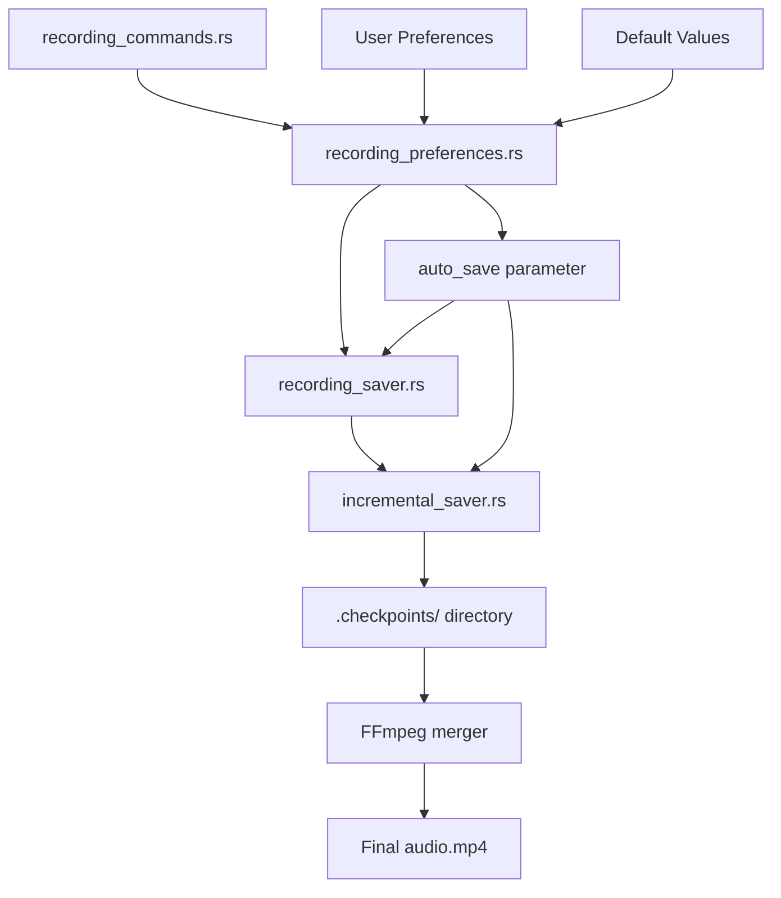
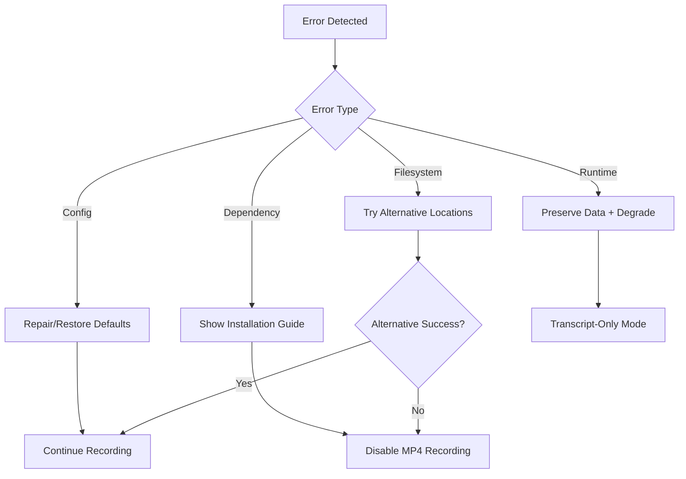

# Design Document: Meetily MP4 Recording Fix

## Overview

This design addresses the critical bug where MP4 audio recordings are no longer being saved in Meetily. The issue stems from the `auto_save` boolean parameter that controls the entire recording pipeline. When this parameter is false (either due to corruption, incorrect loading, or hardcoded values), no MP4 files are created.

The solution involves a systematic debugging approach followed by targeted fixes to restore the recording functionality. The design emphasizes comprehensive diagnostics, robust error handling, and prevention of future regressions.

## Architecture

The recording system follows a pipeline architecture with clear separation of concerns:



### Key Components

1. **Preference Layer**: Loads and validates user preferences including `auto_save`
2. **Recording Controller**: Orchestrates the recording process based on preferences
3. **Incremental Saver**: Manages checkpoint creation and final MP4 assembly
4. **Diagnostic System**: New component for systematic issue detection
5. **Error Recovery**: Enhanced error handling throughout the pipeline

## Components and Interfaces

### Diagnostic Engine

```rust
pub struct DiagnosticEngine {
    pub preference_validator: PreferenceValidator,
    pub pipeline_tracer: PipelineTracer,
    pub dependency_checker: DependencyChecker,
    pub filesystem_validator: FilesystemValidator,
}

impl DiagnosticEngine {
    pub fn run_full_diagnosis(&self) -> DiagnosticReport;
    pub fn trace_auto_save_parameter(&self) -> ParameterTrace;
    pub fn validate_recording_pipeline(&self) -> PipelineStatus;
}
```

### Enhanced Preference Management

```rust
pub struct RecordingPreferences {
    pub auto_save: bool,
    pub save_location: PathBuf,
    pub checkpoint_interval: Duration,
}

impl RecordingPreferences {
    pub fn load_with_validation() -> Result<Self, PreferenceError>;
    pub fn repair_corrupted_preferences() -> Result<Self, PreferenceError>;
    pub fn ensure_defaults() -> Self;
}
```

### Robust Recording Pipeline

```rust
pub struct RecordingPipeline {
    pub preferences: RecordingPreferences,
    pub saver: Option<IncrementalSaver>,
    pub diagnostics: DiagnosticEngine,
}

impl RecordingPipeline {
    pub fn initialize_with_diagnostics() -> Result<Self, PipelineError>;
    pub fn start_recording(&mut self) -> Result<(), RecordingError>;
    pub fn stop_recording(&mut self) -> Result<PathBuf, RecordingError>;
}
```

### Enhanced Error Types

```rust
#[derive(Debug, thiserror::Error)]
pub enum RecordingError {
    #[error("Auto-save parameter not properly loaded: {0}")]
    AutoSaveParameterError(String),
    
    #[error("FFmpeg not found or not executable: {0}")]
    FFmpegNotFound(String),
    
    #[error("Cannot create meeting folder: {0}")]
    MeetingFolderError(String),
    
    #[error("Checkpoint creation failed: {0}")]
    CheckpointError(String),
    
    #[error("File merging failed: {0}")]
    MergingError(String),
}
```

## Data Models

### Diagnostic Report

```rust
pub struct DiagnosticReport {
    pub auto_save_status: AutoSaveStatus,
    pub preference_status: PreferenceStatus,
    pub pipeline_status: PipelineStatus,
    pub dependency_status: DependencyStatus,
    pub filesystem_status: FilesystemStatus,
    pub recommendations: Vec<FixRecommendation>,
}

pub enum AutoSaveStatus {
    Enabled,
    Disabled,
    Corrupted,
    NotFound,
    HardcodedFalse(String), // Location where it's hardcoded
}
```

### Parameter Trace

```rust
pub struct ParameterTrace {
    pub source: ParameterSource,
    pub value: bool,
    pub propagation_path: Vec<ComponentTrace>,
    pub override_points: Vec<OverridePoint>,
}

pub struct ComponentTrace {
    pub component: String,
    pub received_value: bool,
    pub passed_value: bool,
    pub location: String,
}
```

### Recovery Strategy

```rust
pub struct RecoveryStrategy {
    pub primary_fix: FixAction,
    pub fallback_actions: Vec<FixAction>,
    pub validation_steps: Vec<ValidationStep>,
}

pub enum FixAction {
    RepairPreferences,
    RemoveHardcodedFalse(String),
    InstallFFmpeg,
    CreateMeetingFolder(PathBuf),
    RestoreDefaults,
}
```

## Correctness Properties

*A property is a characteristic or behavior that should hold true across all valid executions of a system-essentially, a formal statement about what the system should do. Properties serve as the bridge between human-readable specifications and machine-verifiable correctness guarantees.*

Now I need to analyze the acceptance criteria to determine which ones can be tested as properties.

<function_calls>
<invoke name="prework">
<parameter name="featureName">meetily-mp4-recording-fix

Based on the prework analysis, I can consolidate the many individual acceptance criteria into a smaller set of comprehensive properties that eliminate redundancy:

**Property 1: Diagnostic system validates recording pipeline state**
*For any* recording system configuration, the diagnostic engine should correctly identify the auto_save parameter value, its source, and any issues in the pipeline initialization
**Validates: Requirements 1.1, 1.2, 1.3, 2.1, 2.2**

**Property 2: External dependency validation**
*For any* system environment, the diagnostic system should correctly detect FFmpeg availability and filesystem permissions for meeting folder creation
**Validates: Requirements 1.4, 1.5**

**Property 3: Recording pipeline behavior with auto_save enabled**
*For any* recording session with auto_save=true, the system should create checkpoints directory, save 30-second chunks, and merge them into final MP4 in the meeting folder
**Validates: Requirements 3.1, 3.2, 3.3, 3.4, 2.3, 2.4, 2.5**

**Property 4: Recording pipeline behavior with auto_save disabled**
*For any* recording session with auto_save=false, the system should only save transcripts and discard audio chunks
**Validates: Requirements 3.5**

**Property 5: Preference management robustness**
*For any* preference file state (missing, corrupted, or valid), the system should load auto_save parameter correctly, defaulting to true when necessary, and persist updates reliably
**Validates: Requirements 4.1, 4.2, 4.3, 4.4, 4.5**

**Property 6: Error handling and graceful degradation**
*For any* error condition (FFmpeg missing, disk full, folder creation failure), the system should provide clear error messages, attempt recovery, and gracefully degrade to transcript-only mode when necessary
**Validates: Requirements 5.1, 5.2, 5.3, 5.4, 5.5**

**Property 7: Comprehensive logging throughout pipeline**
*For any* recording operation, the system should log auto_save parameter source, checkpoint creation, FFmpeg operations, errors with context, and final file locations
**Validates: Requirements 7.1, 7.2, 7.3, 7.4, 7.5**

**Property 8: End-to-end pipeline validation**
*For any* complete recording workflow, the system should correctly propagate the auto_save parameter through all components and manage the complete file lifecycle
**Validates: Requirements 6.1, 6.4, 6.5**

**Property 9: Error condition testing coverage**
*For any* error scenario (FFmpeg failures, disk issues, permission problems), the testing system should verify graceful handling and appropriate fallback behavior
**Validates: Requirements 6.2, 6.3**

## Error Handling

The error handling strategy focuses on graceful degradation and user guidance:

### Error Categories

1. **Configuration Errors**: Corrupted preferences, missing auto_save parameter
   - Recovery: Restore defaults, repair configuration
   - User Impact: Minimal, automatic recovery

2. **Dependency Errors**: FFmpeg not found, incorrect version
   - Recovery: Clear error messages with installation guidance
   - User Impact: Recording disabled until resolved

3. **Filesystem Errors**: Cannot create folders, insufficient permissions
   - Recovery: Alternative save locations, permission guidance
   - User Impact: May require user intervention

4. **Runtime Errors**: Checkpoint creation fails, merging fails
   - Recovery: Preserve partial data, continue with transcripts
   - User Impact: Partial functionality maintained

### Error Recovery Flow



## Testing Strategy

The testing approach combines comprehensive property-based testing with targeted unit tests for specific scenarios.

### Property-Based Testing

Property-based tests will use the `proptest` crate to generate random inputs and validate universal properties. Each test will run a minimum of 100 iterations to ensure comprehensive coverage.

**Test Configuration:**
- Library: `proptest` for Rust
- Iterations: 100 minimum per property test
- Generators: Custom generators for preference files, recording states, error conditions
- Shrinking: Enabled to find minimal failing cases

**Property Test Structure:**
```rust
#[cfg(test)]
mod property_tests {
    use proptest::prelude::*;
    
    proptest! {
        #[test]
        fn diagnostic_validates_pipeline_state(
            config in recording_config_strategy(),
            preferences in preference_strategy()
        ) {
            // Feature: meetily-mp4-recording-fix, Property 1: Diagnostic system validates recording pipeline state
            let diagnostic = DiagnosticEngine::new();
            let report = diagnostic.run_diagnosis(&config, &preferences);
            
            // Property validation logic
            prop_assert!(report.correctly_identifies_auto_save_source());
            prop_assert!(report.detects_pipeline_issues());
        }
    }
}
```

### Unit Testing Balance

Unit tests complement property tests by focusing on:

**Specific Examples:**
- Known good configurations that should work
- Specific error scenarios that have occurred in production
- Edge cases identified during development

**Integration Points:**
- Component interactions and data flow
- External dependency integration (FFmpeg, filesystem)
- Error propagation between components

**Regression Prevention:**
- Specific bug scenarios that caused the original issue
- Previously fixed issues to prevent re-introduction

### Test Organization

```
tests/
├── unit/
│   ├── preference_loading_tests.rs
│   ├── diagnostic_engine_tests.rs
│   └── error_handling_tests.rs
├── property/
│   ├── recording_pipeline_properties.rs
│   ├── preference_management_properties.rs
│   └── error_recovery_properties.rs
└── integration/
    ├── end_to_end_recording_tests.rs
    └── ffmpeg_integration_tests.rs
```

Each property test will be tagged with comments referencing the design document property:
- **Feature: meetily-mp4-recording-fix, Property 1: Diagnostic system validates recording pipeline state**
- **Feature: meetily-mp4-recording-fix, Property 2: External dependency validation**
- And so on for all 9 properties

The dual testing approach ensures both comprehensive input coverage (property tests) and specific scenario validation (unit tests), providing confidence that the MP4 recording functionality will work reliably across all conditions.